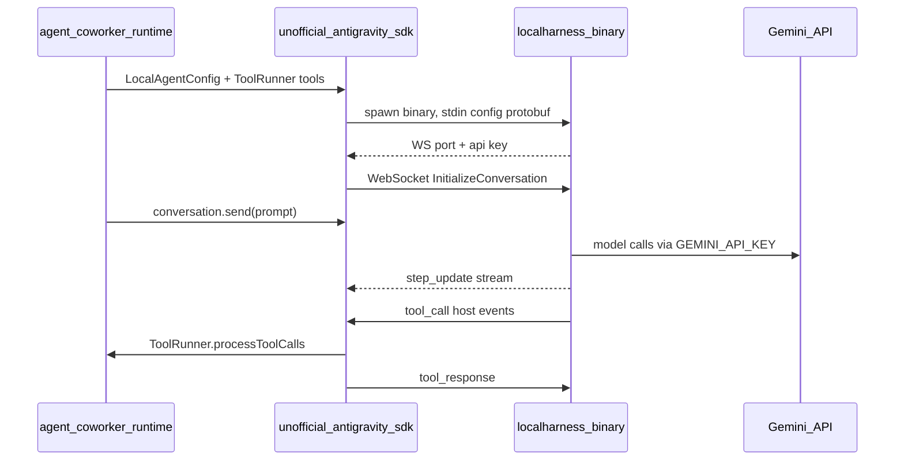
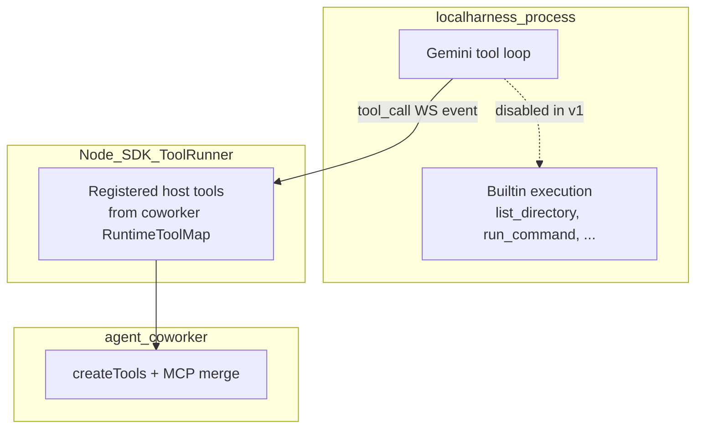
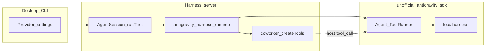

# Antigravity Provider Integration

## SDK summary (from `node_modules/unofficial-antigravity-sdk`)

The package is a TypeScript port of Google Antigravity that drives a **bundled `localharness` binary** (not a plain REST adapter):



**Key APIs to use:**

| Export | Role |
|--------|------|
| [`LocalAgentConfig`](node_modules/unofficial-antigravity-sdk/dist/config.d.ts) | Model (`geminiConfig.models.default`), `apiKey`, `workspaces`, `systemInstructions`, `conversationId` |
| [`Agent.open()`](node_modules/unofficial-antigravity-sdk/dist/agent.d.ts) | Start harness + conversation |
| [`BuiltinTools`](node_modules/unofficial-antigravity-sdk/dist/config.d.ts) | Disable harness-native file/shell tools |
| [`zodTool` / `toolWithSchema`](node_modules/unofficial-antigravity-sdk/dist/tools/custom_tool.d.ts) | Register coworker tools on `ToolRunner` |
| [`allow_all()`](node_modules/unofficial-antigravity-sdk/dist/hooks/policy.d.ts) | Policy for host-executed tools |
| [`Conversation.send` + `receiveSteps`](node_modules/unofficial-antigravity-sdk/dist/conversation.d.ts) | Turn input + streaming |

**Auth (SDK-enforced):** [`local_connection.js`](node_modules/unofficial-antigravity-sdk/dist/connections/local/local_connection.js) resolves `config.apiKey || process.env.GEMINI_API_KEY` and rejects if missing.

**Default model in SDK:** `gemini-3.5-flash` ([`types.d.ts`](node_modules/unofficial-antigravity-sdk/dist/types.d.ts)).

**Platform support:** `darwin-arm64`, `linux-arm64`, `linux-x64` only ([`vendor/localharness/manifest.json`](node_modules/unofficial-antigravity-sdk/vendor/localharness/manifest.json)). No Windows / Intel-macOS binaries — runtime must fail fast with a clear error.

**Codex parallel:** Codex uses provider `codex-cli` + runtime `codex-app-server` + dedicated [`codexAppServerRuntime.ts`](src/runtime/codexAppServerRuntime.ts). Antigravity should follow the same split: thin provider module + harness runtime, not the PI / `google-interactions` path.

---

## Provider contract

| Field | Value |
|-------|--------|
| `ProviderName` | `antigravity` |
| UI label | `Antigravity` |
| `RuntimeName` | `antigravity-harness` |
| Models | `gemini-3.5-flash` (default), `gemini-3.1-pro-preview` |
| API key | `GEMINI_API_KEY` env and/or saved key on `antigravity` connection entry (passed as `LocalAgentConfig.apiKey`) |
| Prompt templates | Reuse existing Google templates: [`config/models/google/gemini-3.5-flash.json`](config/models/google/gemini-3.5-flash.json), [`config/models/google/gemini-3.1-pro-preview.json`](config/models/google/gemini-3.1-pro-preview.json) — copy to `config/models/antigravity/` with `provider: "antigravity"` |

Auth UX: single **API key** method (like OpenAI), labeled for Gemini. **Connected** when `process.env.GEMINI_API_KEY` is set **or** `~/.cowork` connection store has `services.antigravity` api_key (extend [`getProviderCatalog`](src/providers/connectionCatalog.ts) `connected` filter, mirroring env-aware patterns elsewhere).

Do **not** reuse `GOOGLE_GENERATIVE_AI_API_KEY` unless you explicitly want cross-fallback later; you asked for `GEMINI_API_KEY` only.

---

## Core implementation

### 1. Types and routing

Update [`src/types.ts`](src/types.ts):

- Add `"antigravity"` to `PROVIDER_NAMES`
- Add `"antigravity-harness"` to `RUNTIME_NAMES`
- `defaultRuntimeNameForProvider` / `normalizeRuntimeNameForProvider`: `antigravity` → `antigravity-harness` (same pattern as `codex-cli` → `codex-app-server`)

### 2. Provider surface (thin)

New [`src/providers/antigravity.ts`](src/providers/antigravity.ts):

```ts
export const antigravityProvider = {
  keyCandidates: ["antigravity"] as const,
  createModel: () => { throw new Error("antigravity is handled by the antigravity-harness runtime."); },
};
```

Wire in [`src/providers/index.ts`](src/providers/index.ts), [`src/providers/catalog.ts`](src/providers/catalog.ts), [`src/shared/providerAuthMethods.ts`](src/shared/providerAuthMethods.ts) (`api_key` only).

### 3. Model registry

- Add [`config/models/antigravity/gemini-3.5-flash.json`](config/models/antigravity/gemini-3.5-flash.json) and [`config/models/antigravity/gemini-3.1-pro-preview.json`](config/models/antigravity/gemini-3.1-pro-preview.json)
- Register imports in [`src/models/registry.ts`](src/models/registry.ts) (`STATIC_MODEL_PROVIDER_NAMES`, `MODEL_REGISTRY_ENTRIES`)
- Update registry tests in [`test/models.registry.test.ts`](test/models.registry.test.ts)

### 4. Tool model: harness builtins vs coworker host tools

The SDK exposes **two separate tool systems**. Antigravity integration must keep them strictly separated so the model never sees duplicate or harness-native tools.



| Layer | Where defined | How executed | Antigravity v1 policy |
|-------|----------------|--------------|------------------------|
| **Harness builtins** | `CapabilitiesConfig` + `harness_side_tools` at init ([`local_connection.js`](node_modules/unofficial-antigravity-sdk/dist/connections/local/local_connection.js) ~724–751) | Inside harness binary; confirmations via `tool_confirmation_request` | **All disabled** via `disabledTools: BuiltinTools.allTools()`, `enableSubagents: false` |
| **Host / custom tools** | `LocalAgentConfig.tools` → `ToolRunner.getHarnessToolProtos()` | WS `tool_call` → `handleHostToolCall` → `toolRunner.processToolCalls` | **Only coworker tools** from `params.tools` (`RuntimeToolMap` built by `createTools`) |

**Overlap mapping (why builtins stay off):** Harness builtins mirror coworker capabilities under different names. Enabling both would duplicate schemas and split approval flows (harness `tool_confirmation_request` vs coworker `approveCommand` on `bash`).

| Harness builtin | Coworker equivalent | Notes |
|-----------------|---------------------|--------|
| `list_directory` | `glob` | Different API; do not expose harness name |
| `search_directory` | `grep` | Same |
| `find_file` | `glob` | Same |
| `view_file` | `read` | Same |
| `create_file` | `write` | Same |
| `edit_file` | `edit` | Same |
| `run_command` | `bash` | Harness bypasses coworker command approval |
| `ask_question` | `ask` / `AskUserQuestion` | Wire `questions_request` only as defensive fallback |
| `start_subagent` | `spawnAgent` | Disabled with `enableSubagents: false` |
| `generate_image` | _(none in belt)_ | Leave disabled in v1 |
| `finish` | _(harness-only)_ | Not applicable to coworker turn semantics |

**Explicit non-goals for v1:**

- Do **not** register SDK `McpBridge` / `config.mcpServers` — MCP is already merged into coworker `createTools` and must appear only as host tools.
- Do **not** pass a mixed list of harness builtins + coworker tools.
- Do **not** rely on harness `run_command` even in yolo mode; shell policy stays in [`createBashTool`](src/tools/bash.ts).

**Enforcement in config** (both flags required):

```ts
capabilities: new CapabilitiesConfig({
  enableSubagents: false,
  disabledTools: BuiltinTools.allTools(),
}),
tools: buildAntigravityHostTools(params.tools),
policies: [allow_all()],
mcpServers: [],
```

### 5. Host tool bridge: `antigravityToolBridge.ts`

New helper [`src/runtime/antigravityToolBridge.ts`](src/runtime/antigravityToolBridge.ts):

- **`buildAntigravityHostTools(runtimeTools: RuntimeToolMap)`** — returns `LocalAgentConfig.tools` array:
  - One SDK tool per coworker tool name (`bash`, `read`, `grep`, …, plus `mcp__*` names already in the map).
  - Handler: `await tool.execute(args)`; structure result for harness (`{ result }` / `{ error }` per [`sendToolResults`](node_modules/unofficial-antigravity-sdk/dist/connections/local/local_connection.js)).
  - Schema: prefer `zodTool` + `schemaFromZod` when `inputSchema` is Zod; else `toolWithSchema` + [`toPiJsonSchema`](src/runtime/piRuntimeOptions.ts).
  - Preserve tool **names exactly** as coworker exposes them (transcript / JSON-RPC projector stability).
- **`registerHostToolsOnAgent(agent, runtimeTools)`** — when reusing a pooled `Agent`, register the same definitions on `agent.toolRunner` at session start.
- **Approvals / ask:** Host path uses coworker `approveCommand` / `askUser` inside `tool.execute`. Harness `tool_confirmation_request` should not fire when builtins are disabled; if `questions_request` arrives anyway, bridge to `params.askUser` defensively.

### 6. New runtime: `antigravityHarnessRuntime.ts`

New file under [`src/runtime/`](src/runtime/) implementing `LlmRuntime`:

**Config build per turn** (uses §5 bridge):

```ts
new LocalAgentConfig({
  apiKey: resolveAntigravityApiKey(savedKey),
  geminiConfig: new GeminiConfig({
    models: new ModelConfig({ default: new ModelEntry(modelId, apiKey) }),
  }),
  workspaces: [params.config.workingDirectory],
  systemInstructions: new CustomSystemInstructions(params.system),
  conversationId: resumedConversationId,
  capabilities: new CapabilitiesConfig({
    enableSubagents: false,
    disabledTools: BuiltinTools.allTools(),
  }),
  policies: [allow_all()],
  tools: buildAntigravityHostTools(params.tools),
  mcpServers: [],
});
```

**Turn loop (one coworker `runTurn` ≈ one harness turn):**

1. Resolve API key + platform binary via `getDefaultHarnessBinaryPath()`; throw readable error if unsupported OS/arch.
2. Open `Agent` (or reuse pooled agent keyed by `providerState.conversationId` — prefer **one harness per session** to avoid respawn cost; dispose on session end / model change).
3. `conversation.send(lastUserContent)` — map final user message from `params.messages` (text + optional image parts using SDK `Image` / `fromFile` helpers where `supportsImageInput` applies).
4. `for await (const step of conversation.receiveSteps())` until connection idle:
   - Text/thinking deltas → `onModelStreamPart` (`text-delta`, `reasoning-delta`, start/end ids — mirror [`codexAppServerRuntime.ts`](src/runtime/codexAppServerRuntime.ts) chunk shapes the projector already understands)
   - `TOOL_CALL` steps → already executed by SDK host path; still emit stream parts if needed for UI
5. `abortSignal` → `conversation.cancel()` (`halt_request`)
6. Return `RuntimeRunTurnResult` with assistant text, optional `reasoningText`, usage mapped from `conversation.lastTurnUsage`, and updated `providerState`

**Continuation state** (new type in [`src/shared/providerContinuation.ts`](src/shared/providerContinuation.ts)):

```ts
{ provider: "antigravity"; model: string; conversationId: string; updatedAt: string }
```

Persist `conversationId` from `agent.conversationId` / connection so later turns resume the same harness cascade.

**Interactions to wire:**

- SDK `handleQuestionRequest` → `params.askUser` (when harness asks; rare if built-ins disabled)
- Coworker `approveCommand` already handled by `bash` tool, not harness `run_command`

**v1 limitations (document in code comments):**

- No `registerSteerHandler` equivalent (SDK only has `cancel`); steer can no-op or cancel+error until harness adds steer
- Multimodal: support images on user turn if straightforward; otherwise gate with model metadata

Register runtime in [`src/runtime/index.ts`](src/runtime/index.ts). Guard in [`src/runtime/piRuntime.ts`](src/runtime/piRuntime.ts): `antigravity` must not use PI.

### 7. Catalog, status, desktop labels

| File | Change |
|------|--------|
| [`src/providers/connectionCatalog.ts`](src/providers/connectionCatalog.ts) | `PROVIDER_LABELS.antigravity = "Antigravity"`; `connected` includes env `GEMINI_API_KEY` |
| [`apps/desktop/src/lib/providerDisplayNames.ts`](apps/desktop/src/lib/providerDisplayNames.ts) | `antigravity: "Antigravity"` |
| [`src/providerStatus.ts`](src/providerStatus.ts) | Optional: treat env `GEMINI_API_KEY` as authorized for status display |

### 8. Tools (`createTools` layer)

[`src/tools/index.ts`](src/tools/index.ts): Antigravity uses the **standard coworker toolbelt** (same as Google), not the Codex-trimmed set:

- Include `bash`, `read`, `write`, `edit`, `glob`, `grep`, `webFetch`, `ask`, `todoWrite`, `skill`, `memory`, `usage`, agent-control tools when applicable.
- Legacy `webSearch` follows the same rule as Google (omit when native Google web tools config applies; antigravity does not use Google Interactions native web tools, so legacy web search likely stays available — mirror Google provider gating explicitly in a small branch if needed).
- **No** antigravity-specific duplicate tools (do not add `list_directory`, `run_command`, etc. to `createTools`).

The runtime bridge (§5) is the only place SDK tools are registered; `createTools` remains the single source of tool behavior and policy.

Add a `createTools(...)` regression test for `provider: "antigravity"` per engineering rules.

### 9. Packaging note

Harness binaries ship inside `unofficial-antigravity-sdk/vendor/localharness/`. Ensure server/desktop packaging includes `node_modules/unofficial-antigravity-sdk/vendor/**` (verify [`scripts/build_desktop_resources.ts`](scripts/build_desktop_resources.ts) already copies full `node_modules` for the sidecar; if not, add an explicit copy rule).

---

## Tests

| Test | Purpose |
|------|---------|
| [`test/runtime.antigravity-harness.test.ts`](test/runtime.antigravity-harness.test.ts) | Mock/spawn harness via env override if SDK exposes hook; otherwise mock `Agent`/`LocalConnectionStrategy` with DI seam on runtime factory |
| [`test/runtime.antigravity-tool-bridge.test.ts`](test/runtime.antigravity-tool-bridge.test.ts) | Assert `buildAntigravityHostTools` registers coworker names only; harness init config has empty/disabled `harness_side_tools`; host handler invokes `execute` and returns harness-shaped JSON |
| [`test/types.test.ts`](test/types.test.ts) | Provider/runtime normalization |
| [`test/models.registry.test.ts`](test/models.registry.test.ts) | New provider entries |
| [`test/providers/connection-catalog.test.ts`](test/providers/connection-catalog.test.ts) | Label + connected with `GEMINI_API_KEY` |
| `createTools` regression | All tool factories instantiate for `antigravity` |

Run full CI lane: `bun test --max-concurrency 1`, `bun run typecheck`, `bun run docs:check`. Desktop UI change is provider list only — optional CDP smoke after implementation.

---

## Architecture diagram (coworker placement)



---

## Out of scope (unless you expand later)

- Windows / Intel Mac harness support (upstream SDK gap)
- Sharing Google provider's saved API key automatically (different env var names)
- Child-agent routing to Antigravity models (can add refs later)
- WebSocket protocol doc changes (provider catalog already exposed; no new JSON-RPC methods expected)
