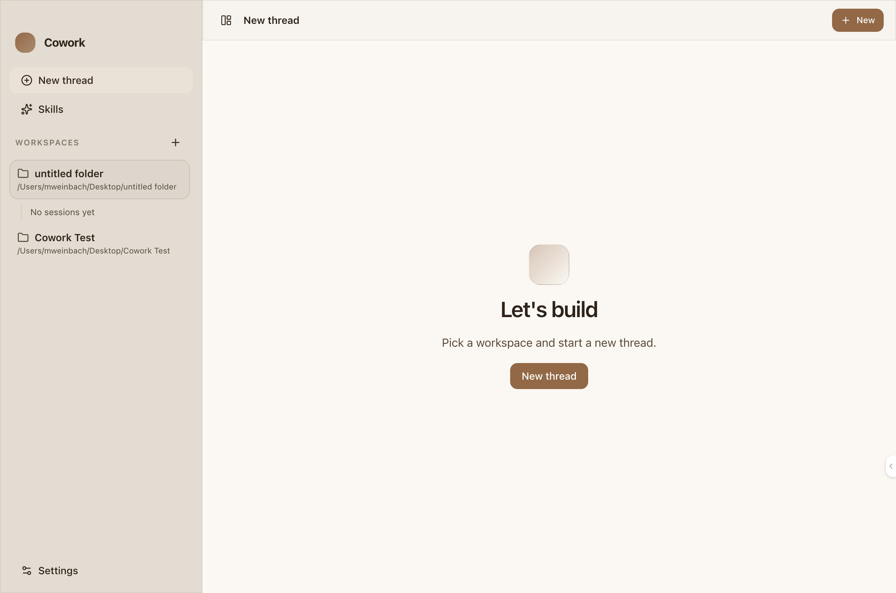

# agent-coworker

A local-first coding agent backend with CLI and desktop clients. An archived TUI is available but no longer maintained.

`agent-coworker` is built around one architectural decision: the agent lives behind a WebSocket server, not inside a single UI. The server owns sessions, tool execution, provider auth, MCP, persistence, safety checks, and streaming. The CLI REPL, Electron app, and any custom client are thin clients on top of the same protocol.

If you want "an AI terminal app", you can use it that way. If you want "an agent backend with a documented control plane and multiple frontends", that is what this repo actually is.

<p align="center">
  
</p>

## Why this project exists

Most coding agents collapse the runtime, UI, and provider glue into one product surface. That makes them hard to extend, hard to automate, and hard to trust once they start touching a real workspace.

Cowork takes the opposite approach:

- The server is the product boundary. UIs render state and send typed protocol messages.
- Sessions are persistent, resumable objects backed by SQLite, not just transient chat tabs.
- Tool execution happens server-side with command approvals and explicit `--yolo` escape hatches.
- Providers are first-class integrations with auth methods, connection status, and per-session model configuration.
- Skills, MCP servers, subagents, and checkpointed workspace backups are part of the core system, not afterthought plugins.

## Highlights

- Interfaces: plain CLI REPL, Electron desktop app, and custom WebSocket clients.
- Local-first workflow: your repo stays on your machine; external calls only happen through the providers and tools you configure.
- Server-side tools for shell, files, search, fetch, notebook edits, memory, task tracking, and subagent delegation.
- Persistent session history in `~/.cowork/sessions.db`, with resume support across restarts.
- Session backup and checkpoint APIs for restoring a workspace to its original or checkpointed state.
- Layered skills and MCP configuration for project, user, global, and built-in capabilities.
- Provider catalog, auth, and status flows for Google, OpenAI, Anthropic, and `codex-cli`.
- Harness and observability hooks for repeatable runs, traces, and artifact capture.

## Quickstart

### 1. Install

Prerequisite: [Bun](https://bun.sh)

```bash
git clone <repo-url>
cd agent-coworker
bun install
```

### 2. Configure a provider

Live AI turns require at least one configured provider. Starting the server, launching the UIs, and running tests do not.

| Provider | Auth |
| --- | --- |
| Google | `GOOGLE_GENERATIVE_AI_API_KEY` |
| OpenAI | `OPENAI_API_KEY` |
| Anthropic | `ANTHROPIC_API_KEY` |
| Codex CLI | Built-in OAuth or API key flow via Cowork |

Examples:

```bash
export OPENAI_API_KEY=...
```

Or start the CLI and use the built-in connect flow:

```bash
bun run cli
# then inside the REPL:
/connect codex-cli
```

### 3. Run it

Desktop app (default):

```bash
bun run start
```

This runs the Electron app in dev mode (`electron-vite` under `apps/desktop`). It does not accept `--dir`; add or select a workspace in the UI.

Plain CLI REPL:

```bash
bun run cli
```

Open the CLI with a specific workspace directory:

```bash
bun run cli -- --dir /path/to/project
```

Standalone server for headless use or custom clients:

```bash
bun run serve
bun run serve -- --dir /path/to/project
bun run serve -- --json
```

Build a standalone Bun binary (`cowork-server`) that can be bundled into other apps:

```bash
bun run build:server-binary
./dist/cowork-server --host 0.0.0.0 --port 7337```

On startup, `cowork-server` logs the bound WebSocket URL and, when using `--host 0.0.0.0`, prints reachable LAN IPv4 addresses for easy embedding/debugging.
Windows ARM64 release builds are staged as runnable bundles instead of single compiled executables. Those bundles include `bun.exe`, a Bun-targeted server bundle, the launcher script, and the built-in `prompts/`, `config/`, and `docs/` assets.

## Clients

### Desktop

The Electron app is the primary workstation client with:

- workspace management
- provider settings and auth
- MCP settings and validation
- chat transcript rendering
- thread history
- native menus, dialogs, notifications, and updater plumbing
- Windows x64 and Windows ARM64 packaged releases

Run it in development with:

```bash
bun run desktop:dev
```

### CLI REPL

The CLI is a lightweight readline client for the same server. It supports slash commands for provider and model control, session switching, connection flows, and tool listing.

Useful commands include:

- `/connect <provider>`
- `/provider <name>`
- `/model <id>`
- `/sessions`
- `/resume <sessionId>`
- `/tools`

### Custom clients

The WebSocket protocol is documented in [docs/websocket-protocol.md](docs/websocket-protocol.md). It covers much more than chat:

- provider catalog, auth methods, auth callbacks, logout, and status
- MCP server CRUD, validation, and auth
- session listing, deletion, title changes, pagination, and file uploads
- backup/checkpoint/restore flows
- subagent creation and persistent subagent session management
- observability and harness context

## Archived clients

### TUI (archived)

> **Note**: The TUI is archived and no longer maintained. It may be removed in a future release.

The terminal UI was built with OpenTUI and Solid.js. It is not a thin text wrapper around the CLI; it renders the same structured server events the desktop app uses:

- streamed assistant text, reasoning, and tool activity
- approval and ask prompts
- todo state
- session backup status
- session lists, themes, prompt stash, and command palette flows

To run the archived TUI:

```bash
bun run tui
```

## Architecture

```text
CLI / Desktop / Custom Client
                |
                v
        WebSocket protocol
                |
                v
     agent-coworker server runtime
  sessions | auth | MCP | persistence
  tools    | streaming | checkpoints
                |
                v
      model runtimes and tool execution
```

A few architectural boundaries matter:

- Business logic belongs in the server, not in the clients.
- Sessions are durable and resumable.
- Tools execute on the server in the workspace context.
- Clients consume `ServerEvent`s and send `ClientMessage`s.

If you want the exact wire contract, use [docs/websocket-protocol.md](docs/websocket-protocol.md). If you want the broader component map, use [docs/architecture.md](docs/architecture.md).

## Tools, skills, and MCP

### Built-in tools

Cowork ships with server-side tools for:

- shell execution: `bash`
- file reads and writes: `read`, `write`, `edit`
- workspace search: `glob`, `grep`
- web research: `webSearch`, `webFetch`
- workflow control: `ask`, `todoWrite`, `spawnAgent`
- artifact editing: `notebookEdit`
- contextual guidance: `skill`, `memory`

Some sessions also expose persistent-agent control tools such as `spawnPersistentAgent`, `listPersistentAgents`, `sendAgentInput`, `waitForAgent`, and `closeAgent`.

`webSearch` supports Brave or Exa depending on configured credentials. `webFetch` is not just a raw fetch; it extracts readable web pages into markdown-friendly text, includes page links and image links when Exa returns them, and saves direct image/document downloads into `Downloads/` with a returned local file path.

### Skills

Skills are instruction bundles rooted in `SKILL.md`. They are discovered from layered locations:

1. `.agent/skills` in the current workspace
2. `~/.cowork/skills`
3. `~/.agent/skills`
4. built-in `skills/`

Built-in curated skills currently cover document, PDF, slide, and spreadsheet workflows. See [docs/custom-tools.md](docs/custom-tools.md) if you want to extend the system further.

### MCP

Cowork supports Model Context Protocol servers with layered config and auth:

1. `.cowork/mcp-servers.json`
2. `~/.cowork/config/mcp-servers.json`
3. `config/mcp-servers.json`

Supported flows include stdio and HTTP/SSE transports plus API-key and OAuth auth modes. See [docs/mcp-guide.md](docs/mcp-guide.md).

## Persistence and safety

Persistence is a core feature, not a convenience cache.

- Canonical session storage lives in `~/.cowork/sessions.db`.
- Legacy JSON session snapshots are import-only compatibility data.
- Backup artifacts live under `~/.cowork/session-backups`.
- Desktop transcript JSONL files are a renderer cache, not the source of truth.

Safety model:

- risky tool actions go through approval flows
- `--yolo` disables command approvals when you explicitly want that behavior
- sessions can be checkpointed and restored through the protocol

For the full storage model, see [docs/session-storage-architecture.md](docs/session-storage-architecture.md).

## Development

Common commands:

```bash
bun test
bun run typecheck
bun run docs:check
bun run dev
bun run desktop:dev
bun run harness:run
```

Notes:

- `bun install` at the repo root also installs desktop dependencies.
- `bun run typecheck` covers the root project and `apps/desktop`.
- `apps/TUI` is archived and not part of the default typecheck command.
- The test suite is deterministic and does not require provider credentials.

## Repository map

| Path | Purpose |
| --- | --- |
| `src/server/` | WebSocket server, protocol, session orchestration, persistence, backup |
| `src/cli/` | CLI REPL and command parsing |
| `src/tui/` | Thin TUI entrypoint (archived, may be removed) |
| `src/tools/` | Built-in server-side tools |
| `src/providers/` | Provider catalog, auth, and model adapters |
| `src/mcp/` | MCP config, auth, and client lifecycle |
| `apps/TUI/` | Main OpenTUI + Solid TUI implementation (archived, may be removed) |
| `apps/desktop/` | Electron desktop app |
| `skills/` | Bundled built-in skills |
| `docs/` | Protocol, architecture, storage, MCP, and harness docs |

## Docs

| Document | What it covers |
| --- | --- |
| [docs/websocket-protocol.md](docs/websocket-protocol.md) | Canonical WebSocket contract for custom clients |
| [docs/architecture.md](docs/architecture.md) | Component-level system overview |
| [docs/mcp-guide.md](docs/mcp-guide.md) | MCP setup, layering, and auth |
| [docs/session-storage-architecture.md](docs/session-storage-architecture.md) | SQLite session storage and resume behavior |
| [docs/custom-tools.md](docs/custom-tools.md) | Extending Cowork with custom tools |
| [docs/harness/index.md](docs/harness/index.md) | Harness docs index |
| [docs/harness/config.md](docs/harness/config.md) | Harness config precedence, env vars, and runtime flags |
| [docs/harness/runbook.md](docs/harness/runbook.md) | Running harness scenarios and collecting artifacts |
| [docs/harness/observability.md](docs/harness/observability.md) | Langfuse and observability wiring |

## Status

This is an actively developed local agent system. The architecture is stable enough to build on, but the project is still moving quickly, especially around protocol surface, desktop polish, and provider/runtime behavior.

If you want to contribute, the safest mental model is:

- the server owns behavior
- the protocol is a public contract
- UIs are clients
- README claims should match the code
